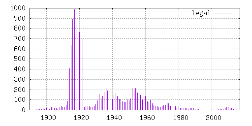

Counting movies in IMDB that are free to distribute on the Internet
===================================================================

Here are a set of tools to try to identify and count the number of
movies in [the Internet Movie Database](https://www.imdb.com/) it is
legal to distribute on the internet, either because they are no longer
copyright protected (aka public domain) or because they are licenced
using a license allowing such distribution (for example with a
[Creative Commons](https://creativecommons.org/) license.

Various sources are consulted, and here is a year histogram for the
unique IMDB title IDs to be identified so far:



Several sources are consulted, and a JSON file for each source is
generated.  The JSON format look like this:

```
{
    "http://www.imdb.com/title/tt0000005/" : {
	"status" : "free",
	"freenessurl" : "https://archive.org/details/blacksmith1893",
	"wp" : "https://en.wikipedia.org/wiki/Blacksmith_Scene",
        "wdurl": "https://www.wikidata.org/wiki/Q470705",
	"title" : "Blacksmith",
	"year" : 1893
    }
}
```

The key is the IMDB title ID of the movie, or some other unique and
idenfitying URL if such IMDB ID is not known.  Note the structure of
the IMDB URL with trailing slash and www.imdb.com as the hostname.
URLs must be normalized to this format.

The JSON fields are as follows:

 * title - the movie title, preferably the title registered in IMDB,
   but any title is OK.  This is used to manually check if the mapping
   betweeen freenessurl and IMDB ID is correct.

 * year - the publication / screening year of the movie, preferably
   the year registered in IMDB, but any relevant year is OK.  This is
   used to manually check if the mapping betweeen freenessurl and IMDB
   ID is correct.

 * status - indicate the status of the movie.  Use 'free' for those
   that are distributable, 'unknown' if the status is unverified and
   'non-free YYYY-MM-DD' if the status is verified and it is not legal
   to distribute the movie at the moment.

 * freenessurl - URL to a web page to back up the claim that the movie
   status is 'free'.

 * wp - link to a (preferably English) Wikipedia page about the movie.
   This normally form the basis for a wikidata page about the same
   movie.

 * wdurl - link to the wikidata page about the movie.

Only the 'status' field is required, and the 'freenessurl' field if
the status is 'free'.  One should try to fill in as many fields as
possible for easier validation of the field.

The file `free-movies-manual.json` is manually generated, to have a
place to store the status of free movies that are currently missing in
the automatically generated lists.
